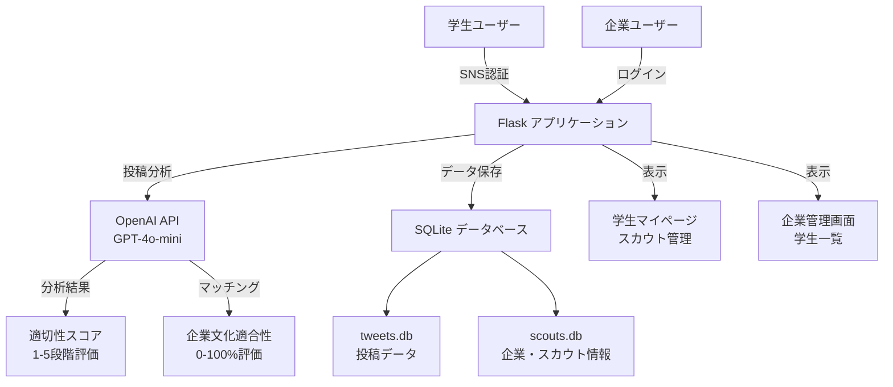
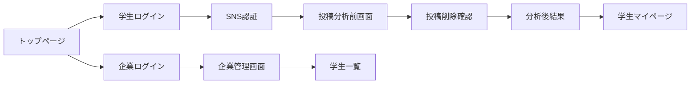

# SHOWME - SNS連携就活マッチングサイト

SNSを登録するだけでスカウトが来る就活サイト。学生のSNS投稿を分析し、企業との最適なマッチングを実現します。

## 概要

SHOWMEは、学生のSNS（Twitter）投稿を分析して企業とのマッチング精度を向上させる革新的な就活支援プラットフォームです。AI技術を活用し、投稿内容から学生の性格や志向を分析し、企業文化との適合性を評価します。

### 背景・課題解決

**企業側の課題**
- ESやWebテストでは分からない学生の"人間味"を知りたい
- 面接まで進まないと人物像が見えない
- SNSアカウント特定に費用をかけている

**学生側の課題**
- 日々の努力や活動をアピールしたいが、SNSに不適切な投稿が混在
- 就活でSNSを見せることに不安を感じている

**解決策**
生成系AIを使ってSNS投稿をスクリーニングし、印象の悪い投稿を削除提案することで、学生が安心して就活にSNSを活用できる環境を提供します。

## 主要機能

### 学生向け機能
- **SNS認証ログイン**: Twitterアカウントでのかんたんログイン
- **投稿分析**: AI（GPT-4o-mini）による投稿内容の自動分析
- **スコア算出**: 投稿内容から適切性スコア（1-5段階）を計算
- **投稿管理**: 不適切な投稿の検出と削除提案
- **企業スカウト管理**: 企業からのスカウト情報の閲覧・管理
- **マッチング率表示**: 企業文化との適合性をパーセンテージで表示

### 企業向け機能
- **学生一覧表示**: マッチング率順での学生表示
- **詳細分析**: 学生の投稿から生成される性格分析レポート
- **マッチング理由**: AIによる適合性の詳細説明
- **業界別フィルタリング**: 志望業界での絞り込み

## システム構成



## 技術スタック

### バックエンド
- **Python 3.x**
- **Flask** - Webアプリケーションフレームワーク
- **SQLite** - データベース
- **OpenAI API** - AI分析エンジン
- **Tweepy** - Twitter API連携

### フロントエンド
- **HTML5/CSS3**
- **Flask-WTF** - フォーム処理
- **Bootstrap風スタイリング**

### 主要ライブラリ
```
Flask==3.0.3
openai==1.40.2
tweepy==4.14.0
Flask-WTF==1.2.1
WTForms==3.1.2
```

## データベース設計

### tweets.db
投稿データの管理
```sql
tweets (
    id INTEGER PRIMARY KEY,
    text TEXT NOT NULL,           -- 投稿内容
    date TEXT NOT NULL,           -- 投稿日時
    likes INTEGER,                -- いいね数
    should_delete BOOLEAN,        -- 削除推奨フラグ
    user_id INTEGER NOT NULL,     -- ユーザーID
    score INTEGER                 -- 適切性スコア(1-5)
)
```

### scouts.db
企業・スカウト情報の管理
```sql
scouts (
    id INTEGER PRIMARY KEY,
    name TEXT NOT NULL,           -- 企業名
    date TEXT NOT NULL,           -- 日付
    industry TEXT NOT NULL,       -- 業界
    details TEXT,                 -- 企業詳細
    photo TEXT,                   -- 企業画像URL
    culture TEXT,                 -- 企業文化
    match_rate INTEGER,           -- マッチング率(0-100)
    reason TEXT                   -- マッチング理由
)
```

## AI分析機能

### 投稿適切性分析
- **モデル**: GPT-4o-mini
- **評価基準**: 5段階スコア
  - 1: 非常に不適切/ネガティブ
  - 2: 不適切/ネガティブ
  - 3: 中立
  - 4: 適切/ポジティブ
  - 5: 非常に適切/ポジティブ

### マッチング分析
- **企業文化適合性**: 0-100%での評価
- **分析要素**:
  - 志望業界の一致度
  - 性格と企業文化の適合性
  - 投稿内容から読み取れる人物像

## 画面構成



## セットアップ方法

### 1. リポジトリのクローン
```bash
git clone https://github.com/gochipon/DIS24-Team-B.git
cd DIS24-Team-B
```

### 2. 依存関係のインストール
```bash
pip install -r requirements.txt
```

### 3. 環境変数の設定
```bash
export OPENAI_API_KEY="your_openai_api_key"
```

### 4. Twitter API設定
`app.py`内のAPI設定を更新:
```python
api_key = "YOUR_API_KEY"
api_key_secret = "YOUR_API_KEY_SECRET"
access_token = "YOUR_ACCESS_TOKEN"
access_token_secret = "YOUR_ACCESS_TOKEN_SECRET"
```

### 5. アプリケーション起動
```bash
python app.py
```

アプリケーションは `http://localhost:5000` で起動します。

## 使用方法

### 学生の場合
1. トップページから「sign up」をクリック
2. TwitterアカウントでSNS認証
3. 投稿分析の実行（自動）
4. 不適切な投稿があれば削除を検討
5. マイページでスカウト情報を確認

### 企業の場合
1. トップページの「企業様 log in」をクリック
2. 企業アカウントでログイン
3. 学生一覧ページでマッチング率を確認
4. 学生の詳細分析レポートを閲覧

## 特徴的な機能

### SNS投稿クリーニング機能
- 不適切な投稿の自動検出
- 削除推奨リストの生成
- スコア改善による企業マッチング率向上

### 高精度マッチングシステム
- 企業文化との詳細な適合性分析
- AIによる客観的な評価とフィードバック
- 志望業界と人物像の総合評価

## ライセンス

このプロジェクトは教育目的で作成されています。